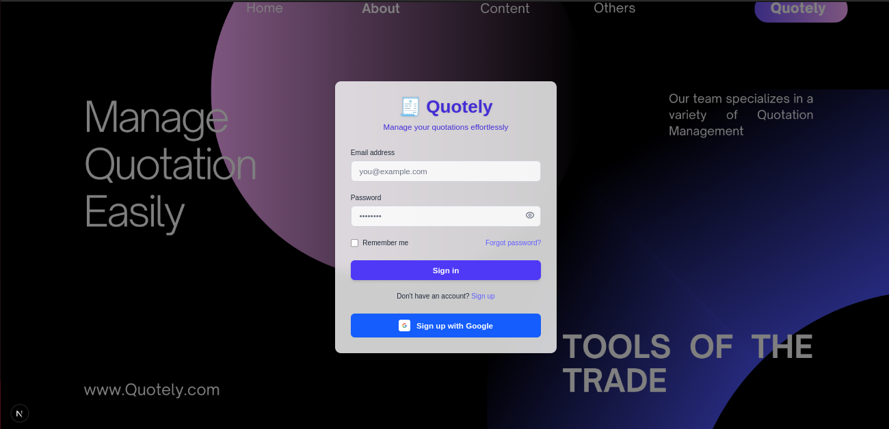
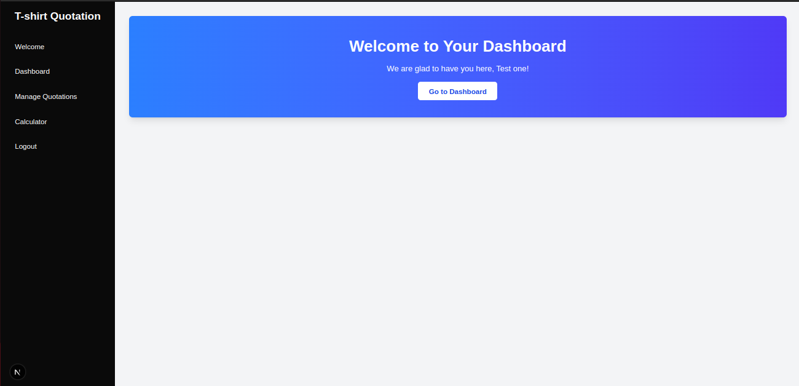
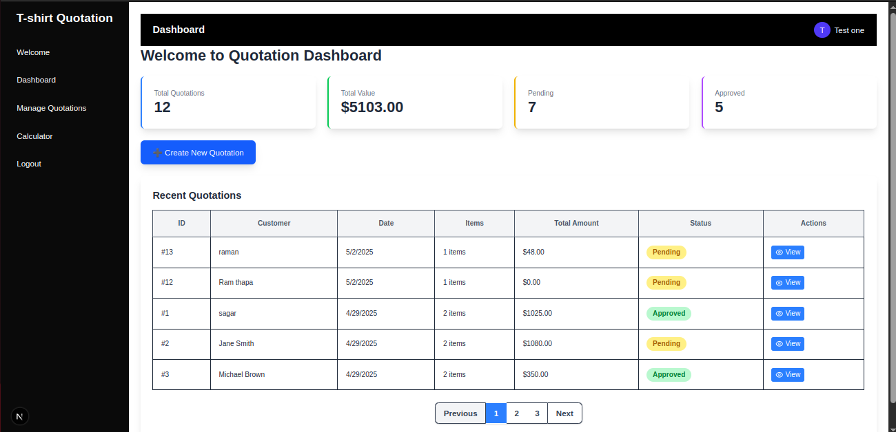
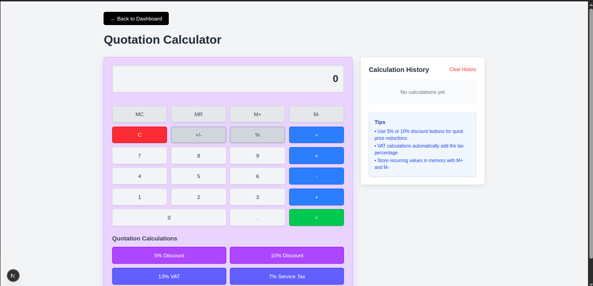

# 🧾 Quotely - T-shirt Quotation Management

Welcome to Quotely! This easy-to-use app helps you create and manage quotations for your t-shirt business.



## Technologies Used

This project is built with modern web technologies:
- **Frontend**: Next.js 15.3.1 with React
- **Backend**: Node.js with Express.js
- **Database**: MySQL
- **Styling**: Tailwind CSS

## What Can You Do With Quotely?

- Create professional quotations for your customers
- Track quotation status (pending, approved, or rejected)
- Calculate t-shirt prices easily
- Manage all your business quotations in one place

## Photos of Quotely

### Login Screen


### Welcome Page


### Dashboard


### Managing Quotations


### Creating Quotations


### Editing Quotations


### Price Calculator


## How to Set Up Quotely

### Step 1: Install the software you need

First, make sure you have:
- Node.js (version 18 or higher)
- MySQL (version 8.0 or higher)
- npm or pnpm package manager

Install dependencies for both frontend and backend:

```bash
# Install server dependencies
cd Server
npm install
# or with pnpm
pnpm install

# Install frontend dependencies
cd ../quotation_management
npm install
# or with pnpm
pnpm install
```

### Step 2: Set up the database

#### Option 1: Using MySQL command line

1. Open MySQL command line:
```bash
mysql -u your_username -p
```

2. Create and set up the database:
```sql
CREATE DATABASE quotation_management;
USE quotation_management;

-- Create users table
CREATE TABLE IF NOT EXISTS users (
  id INT AUTO_INCREMENT PRIMARY KEY,
  username VARCHAR(255) NOT NULL UNIQUE,
  email VARCHAR(255) NOT NULL UNIQUE,
  password VARCHAR(255) NOT NULL,
  role ENUM('user', 'admin') DEFAULT 'user',
  created_at TIMESTAMP DEFAULT CURRENT_TIMESTAMP,
  updated_at TIMESTAMP DEFAULT CURRENT_TIMESTAMP ON UPDATE CURRENT_TIMESTAMP
);

-- Create quotations table
CREATE TABLE IF NOT EXISTS quotations (
  id INT AUTO_INCREMENT PRIMARY KEY,
  customer_name VARCHAR(255) NOT NULL,
  items JSON NOT NULL,
  total_amount DECIMAL(10, 2) NOT NULL,
  status ENUM('pending', 'approved', 'rejected') DEFAULT 'pending',
  created_at TIMESTAMP DEFAULT CURRENT_TIMESTAMP,
  updated_at TIMESTAMP DEFAULT CURRENT_TIMESTAMP ON UPDATE CURRENT_TIMESTAMP
);
```

#### Option 2: Using the provided SQL file

Run the SQL file included in the project:
```bash
mysql -u your_username -p < Server/update_schema.sql
```

### Step 3: Configure database connection

Edit the `Server/auth/db-config.js` file to match your MySQL credentials:

```javascript
const mysql = require('mysql2');

const db = mysql.createConnection({
  host: 'localhost',
  user: 'YOUR_MYSQL_USERNAME',
  password: 'YOUR_MYSQL_PASSWORD',
  database: 'quotation_management'
});

module.exports = db;
```

### Step 4: Start the server

Open a terminal and run:
```bash
cd Server
npm start
# or with pnpm
pnpm start
```

The backend server will run on http://localhost:4000

### Step 5: Start the app

Open another terminal and run:
```bash
cd quotation_management
npm run dev
# or with pnpm
pnpm run dev
```

The frontend will run on http://localhost:3000

### Step 6: Open the app in your browser

Go to: http://localhost:3000

## Login Details

For testing, you can use:
- Email: test@example.com
- Password: password123

Or create your own account by clicking "Sign up" on the login page.

